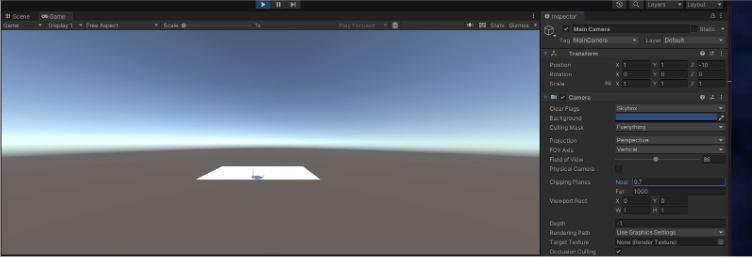
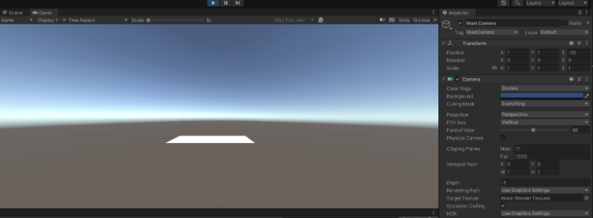

Respuestas a las preguntas ponderadas:

# 1. 
Translate, Rotate y localScale.

# 2. 
Se haría de la siguiente manera:
transform.Translate(transform.position * 2);
transform.Rotate(transform.up * 30);
No se obtendría el mismo resultado pues en las transformaciones en unity el orden importa.

# 3. 

# 4. 

# 5. 
Cuanto menor sea, mayores se renderizan los objetos porque los planos de proyección serán más pequeños.

# 6.
Es cierto ya que en el modo ortográfico se elimina la perspectiva, representando todos los objetos con tamaños proporcionales. Se puede acceder a esta vista desde el inspector haciendo click en la caja central del gizmo localizado en la esquina superior derecha. 

# 7.
camera.transform.rotation = Quaternion.Euler(0f, 30f * Mathf.Deg2Rad, 0f)

# 8. 
Se accede al atributo ‘projectionMatrix’ de la cámara que se quiere estudiar dentro de update (para así acceder a la matriz del último frame), el cual devolverá una Matrix4x4 con los datos pedidos (se puede mostrar esta por consola).

# 9. 
Se accede a ella de forma igual que en el caso anterior, la única diferencia siendo que la propia cámara tiene que ser de vista ortogonal.

# 10.
Accediendo al atributo ‘localToWorldMatrix’ del Transform del GameObject que se pretende estudiar (el cual se debe guardar dentro de una Matrix4x4).

# 11.
Para acceder a la matriz del sistema de referencia de la vista, es decir, la cámara, se usa la función Camera.worldToCameraMatrix

# 12.
      0.97428        0.00000        0.00000        0.00000
      0.00000        1.73205        0.00000        0.00000
      0.00000        0.00000        -1.00060        -0.60018
      0.00000        0.00000        -1.00000        0.00000
      

# 13.
      1.00000        0.00000        0.00000        0.00000
      0.00000        1.00000        0.00000        0.00000
      0.00000        0.00000        1.00000        0.00000
      0.00000        0.00000        0.00000        1.00000
     
# 14. 
      -0.38625        -0.72351        0.57214        -2.40000
      0.00000        0.62027        0.78438        0.25798
     -0.92239        0.30297        -0.23958        3.03000
      0.00000        0.00000        0.00000        1.00000
      
# 15. 
Las coordenadas del sistema de referencia vienen dadas por la propia posición del objeto, cosa que podemos obtener si accedemos a transform.position y la rotación en transform.rotation
